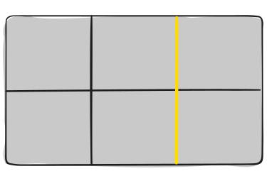
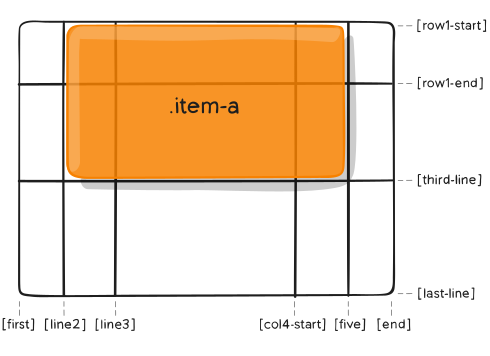

在处理一维布局时，我们一般会采用 flex 布局；而在做二维布局时，grid 布局是一个好的选择。

# 基本概念

---

Grid 布局，即网格布局，是一种基于二维网格的布局系统。

grid container 所有网格项目的父项。

grid item 网格项目。

grid line 构成网格结构的分界线。



grid track 两条相邻网格线之间的间距。


grid cell 两个相邻行和两个相邻列网格线之间的间距。是网格中的一个单元。


grid area 四条网格线包围的总空间。网格区域可以由任意数量的网格单元组成。


# 网格容器

---

通过 display 属性设置属性值为 grid 或 inline-grid 可以创建一个网格容器。网格容器中的所有子元素就会自动变成网格项目（grid item）。

## 显式网格

使用 grid-template-columns 和 grid-template-rows 属性可以显式的设置一个网格的列和行。

- grid-template-rows 指定的每个值可以创建每行的高度。
- grid-template-columns 指定的每个值可以创建每行的列宽。
```css
  .container {
    grid-template-columns: 40px 50px auto 50px 40px;
    grid-template-rows: 25% 100px auto;
  }
```
    

- fr 单位 代表网格容器中可用的空间。

        grid-template-columns: 1fr 1fr 2fr

    该示例中，网格容器分成了4等份。当 fr 和其它长度单位的值结合在一起的时候，fr 是基于网格容器可用空间来计算。

- grid-template-areas

    通过引用用grid - area属性指定的网格区域的名称来定义网格模板。

- minmax 通过 minmax() 函数来创建网格轨道的最小或最大尺寸。
- repeat 使用 repeat() 创建重复的网格轨道。

## 间距

- column-gap 创建列与列之间的间距。
- row-gap 创建行与行之间的间距。
- gap 上面两属性的缩写形式，默认值是0。

## 容器内项目对齐

### justify-items

沿内联(行)轴对齐网格项目。此值适用于容器内的所有网格项目。

- start
- center
- end
- stretch(default)

### align-items

沿着块(列)轴对齐网格项目。此值适用于容器内的所有网格项目。

- start
- center
- end
- stretch(default)

# 网格项目

---

## 通过参考特定的网格线来确定网格项目在网格中的位置。

- grid-column-start
- grid-column-end
- grid-column
- grid-row-start
- grid-row-end
- grid-row
```css
  .item-a {
    grid-column-start: 2;
    grid-column-end: five;
    grid-row-start: row1-start;
    grid-row-end: 3;
  }
```


## 项目对齐

### justify-self

沿内联(行)轴对齐单元格内的网格项目。此值适用于单个单元格内的网格项目。

- start
- center
- end
- stretch(default)

### align-self

沿着块(列)轴对齐单元格内的网格项目。此值适用于单个网格项目内的内容。

- start
- center
- end
- stretch(default)

---

- auto-fill 当容器的大小超过所有组合项目的大小时，auto-fill 会不断插入空行或空栏并将项目推到一边。
- auto-fit 当容器的大小超过所有组合项目的大小时，auto-fit 会折叠这些空行或空栏并拉伸项目以适应容器的大小。

### 增加 fallback support

1. 先写回退代码， 然后使用较新属性覆写。
```
  .selector {property: fallback-value;property: actual-value;}
```
2. 先写回退代码，然后在 `@support` 中覆写。如果需要的话可以在 `@support` 中重置属性查看效果。
```css
  .selector {property: fallback-value;}@supports (display: grid) {.selector {property: actual-value;}}
```
3. 在 `@support` 中写所有 css 代码。
```css
  @supports not (display: grid) {.selector {property: fallback-value;}}@supports (display: grid) {.selector {property: actual-value;}}
```
### 兼容性


### @supports
```css
    @supports <supports_condition> {/* specific rules */}
```
> 一个支持条件是由一个或者多个不同的逻辑操作符组成的表达式声明组合而成的。使用小括号可以调整这些表达式之间的优先级。

### not 操作符

可以放在任何表达式的前面来产生一个新的表达式，为原表达式的值的否定。
```css
    not (transform-origin: 2px)
```
### and 操作符

用来将两个原始的表达式做逻辑与后生成一个新的表达式。

```css
    (display: table-cell) and (display: list-item)
```

### or 操作符

```css
    ( transform-style: preserve ) or ( -moz-transform-style: preserve )
```

参考
[CSS Grid 网格布局教程](http://www.ruanyifeng.com/blog/2019/03/grid-layout-tutorial.html)
[A Complete Guide to Grid](https://css-tricks.com/snippets/css/complete-guide-grid)
